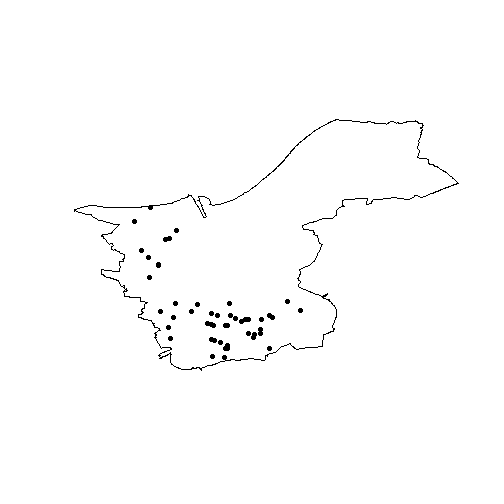

# r311: An R interface to the open311 standard

## Introduction

open311 is an international open-access standard for civic issue
management and public service communication. The standard allows
administrations to better manage citizen requests, citizens to more
easily participate in administrative work, and researchers and data
scientists to access data regarding public service communication. As an
open standard, open311 is not a centralized API, but a framework
implemented by various cities (e.g. San Francisco, CA, Chicago, IL,
Cologne, DE, Turku, FI, Zurich, CH) and services (e.g. SeeClickFix,
FixMyStreet).

It is way past the golden age of open311 APIs and much of development in
civic issue tracking has shifted to less open-access and less
standardized alternatives. Many former prime examples have abandoned or
severely limited their open311 endpoints. Nonetheless, open311 still
constitutes a valuable source for open government data. Many cities and
services still maintain an open311 service.

`r311` allows the seamless management and selection of endpoints and
retrieval of service and request data. It supports (but does not depend
on) many popular R frameworks such as the tidyverse, `sf` and `xml2` for
response formatting. `r311` is designed to be slim, both in content and
dependencies. It imports only two import-less packages used for HTTP
response handling. The functionality is limited to two main features:

- Endpoint management
- Sending requests

This vignette will briefly cover these two features.

## Endpoints

Since open311 is an open and decentralized standard, there is not one
but many endpoints that one can access. An endpoint is commonly
implemented by a city administration, but can also be managed by a
service provider such as FixMyStreet. Each endpoint can define multiple
jurisdiction IDs, although, in practice, most endpoints only define a
single jurisdiction.

It can thus be difficult to manage the multitude of endpoints and
jurisdictions. Efforts have been made to list open311 servers, but most
of them are incomplete or outdated. `r311` offers an updated and
modifiable endpoint list that defines a number of open311
implementations that are defined for use in the package. The list can be
read using `o311_endpoints`.

Load the package:

``` r

library(r311)
```

``` r

o311_endpoints()
#> # A tibble: 69 × 12
#>    name      root  docs  jurisdiction key   pagination limit json  dialect deprecated deprecated_reason deprecated_url
#>    <chr>     <chr> <chr> <chr>        <lgl> <lgl>      <int> <lgl> <chr>   <lgl>      <chr>             <chr>         
#>  1 Annaberg… http… http… annberg-buc… FALSE TRUE          50 TRUE  Mark-a… TRUE       switched          https://buerg…
#>  2 Blooming… http… <NA>  bloomington… FALSE TRUE        1000 TRUE  uReport FALSE      <NA>              <NA>          
#>  3 Bonn, DE  http… http… bonn.de      FALSE TRUE         100 TRUE  Mark-a… FALSE      <NA>              <NA>          
#>  4 Boston, … http… http… <NA>         FALSE TRUE          50 TRUE  Connec… FALSE      <NA>              <NA>          
#>  5 Brooklin… http… http… brooklinema… FALSE TRUE          50 TRUE  Connec… FALSE      <NA>              <NA>          
#>  6 Austin, … http… http… <NA>         FALSE TRUE          50 TRUE  Connec… FALSE      <NA>              <NA>          
#>  7 Chicago,… 311a… 311a… cityofchica… FALSE TRUE          50 TRUE  Connec… FALSE      <NA>              <NA>          
#>  8 Newport … http… http… cityofnewpo… FALSE TRUE          50 TRUE  Connec… FALSE      <NA>              <NA>          
#>  9 San Dieg… http… http… sandiego.gov FALSE TRUE          50 TRUE  Connec… FALSE      <NA>              <NA>          
#> 10 Köln / C… http… <NA>  stadt-koeln… FALSE TRUE          50 TRUE  Mark-a… FALSE      <NA>              <NA>          
#> # ℹ 59 more rows
```

The list does neither claim comprehensiveness nor up-to-dateness. It
arguably provides some of the most important and easily accessible
endpoints as of 2026. However, `r311` also offers the ability to add new
endpoints to `o311_endpoints` using `o311_add_endpoint`. You need to
provide a name (for lookup) and a root URL (the URL used to send
requests). The following code adds the open311 test server of
Mecklenburg-Vorpommern, Germany.

``` r

o311_add_endpoint(
  name = "MV Test",
  root = "https://klarschiff-mv.sis-schwerin.de/backoffice/citysdk/",
  jurisdiction = "rostock.de"
)
```

Retrieving the endpoints list again confirms that you successfully added
a new row to the endpoints dataframe.

``` r

nrow(o311_endpoints())
#> [1] 70
```

You can now select the Rostock test API to the session using `o311_api`.
This function matches an API using endpoint name and jurisdiction ID and
attaches it to the active session. Query functions automatically detect
the attached API.

``` r

o311_api("MV Test")
```

After attaching an API, `o311_ok` confirms that the selected endpoint is
able to handle request queries.

``` r

o311_ok()
#> [1] TRUE
```

As the result is `TRUE`, you can safely start receiving real request
data.

## Making requests

After selecting an API and attaching it to the session, all functions
can access it. You can now make requests.

### Services

To get an overview of the available services in a jurisdiction, you can
use `o311_services`, which returns a list of Rostock’s administrative
services.

``` r

o311_services()
#> # A tibble: 183 × 8
#>    service_code service_name                       description metadata type     keywords group            group_id
#>    <chr>        <chr>                              <lgl>       <lgl>    <chr>    <chr>    <chr>               <int>
#>  1 127          Ampel behindertengerecht gestalten NA          FALSE    realtime idea     Barrierefreiheit       11
#>  2 128          Ampelschaltung ändern              NA          FALSE    realtime idea     Barrierefreiheit       11
#>  3 129          Bordstein absenken                 NA          FALSE    realtime idea     Barrierefreiheit       11
#>  4 130          Zugang rollstuhlgerecht gestalten  NA          FALSE    realtime idea     Barrierefreiheit       11
#>  5 131          Ampelschaltung ändern              NA          FALSE    realtime idea     Fahrradverkehr         12
#>  6 132          Beleuchtung verändern              NA          FALSE    realtime idea     Fahrradverkehr         12
#>  7 133          Beschilderung/Markierung ändern    NA          FALSE    realtime idea     Fahrradverkehr         12
#>  8 134          Beschilderung/Markierung einführen NA          FALSE    realtime idea     Fahrradverkehr         12
#>  9 135          Bordstein absenken                 NA          FALSE    realtime idea     Fahrradverkehr         12
#> 10 136          Fahrradständer aufstellen          NA          FALSE    realtime idea     Fahrradverkehr         12
#> # ℹ 173 more rows
```

### Requests

To get data about civic issues in the city area, run `o311_requests`.

``` r

o311_requests()
#> Simple feature collection with 50 features and 15 fields
#> Geometry type: POINT
#> Dimension:     XY
#> Bounding box:  xmin: 11.36877 ymin: 53.38495 xmax: 13.31174 ymax: 54.20873
#> Geodetic CRS:  WGS 84
#> # A tibble: 50 × 16
#>    service_request_id status_notes      status service_code service_name description agency_responsible service_notice
#>                 <int> <chr>             <chr>         <int> <chr>        <chr>       <chr>              <lgl>         
#>  1                132 <NA>              revie…          129 Bordstein a… "testidee"  Landkreis MSE      NA            
#>  2                163 <NA>              revie…            2 Papierkorb/… "Der Papie… Beschwerdemanagem… NA            
#>  3                251 <NA>              recei…            3 Ampel schad… "redaktion… LK-LUP-Verkehr     NA            
#>  4                285 <NA>              revie…            3 Ampel schad… "Hier geht… LK-LUP-Verkehr     NA            
#>  5                264 Dieses Problem m… in_pr…            4 bauliche Ge… "Hier befi… LK-LUP-Verkehr     NA            
#>  6                268 <NA>              recei…            4 bauliche Ge… "redaktion… Bauamt - Goldberg… NA            
#>  7                213 <NA>              recei…          117 Wegereinigu… "redaktion… Forstamt           NA            
#>  8                292 <NA>              in_pr…            5 Beleuchtung… "Die Daten… Standardzuständig… NA            
#>  9                168 <NA>              recei…          145 Haltestelle… "redaktion… Verkehr LK Rostock NA            
#> 10                295 <NA>              revie…            2 Papierkorb/… "Die Daten… Standardzuständig… NA            
#> # ℹ 40 more rows
#> # ℹ 8 more variables: requested_datetime <chr>, updated_datetime <chr>, expected_datetime <lgl>, address <chr>,
#> #   adress_id <lgl>, media_url <chr>, zipcode <lgl>, geometry <POINT [°]>
```

Using the output of `o311_services`, you can further narrow down the
output of requests. Open311 defines a set of standard parameters which
are implemented by all endpoints. Using the `service_code` parameter
with one of the previously returned service codes, only complaints about
broken traffic lights are returned.

``` r

o311_requests(service_code = "3")
#> Simple feature collection with 6 features and 15 fields
#> Geometry type: POINT
#> Dimension:     XY
#> Bounding box:  xmin: 11.84164 ymin: 53.38651 xmax: 12.31198 ymax: 54.20656
#> Geodetic CRS:  WGS 84
#> # A tibble: 6 × 16
#>   service_request_id status_notes       status service_code service_name description agency_responsible service_notice
#>                <int> <chr>              <chr>         <int> <chr>        <chr>       <chr>              <lgl>         
#> 1                166 Verstanden.        in_pr…            3 Ampel schad… redaktione… Bauamt (Amt Rosto… NA            
#> 2                158 <NA>               revie…            3 Ampel schad… Die Ampel … Straßenmeisterei … NA            
#> 3                251 <NA>               recei…            3 Ampel schad… redaktione… LK-LUP-Verkehr     NA            
#> 4                173 Vorgang wurde zur… in_pr…            3 Ampel schad… Ampel scha… Regional-Administ… NA            
#> 5                250 Vielen Dank für d… in_pr…            3 Ampel schad… Ampel ausg… LK-LUP-Verkehr     NA            
#> 6                285 <NA>               revie…            3 Ampel schad… Hier geht … LK-LUP-Verkehr     NA            
#> # ℹ 8 more variables: requested_datetime <chr>, updated_datetime <chr>, expected_datetime <lgl>, address <chr>,
#> #   adress_id <lgl>, media_url <lgl>, zipcode <lgl>, geometry <POINT [°]>
```

Similarly, using a `service_request_id` from the output, you can
retrieve a single service request from the API.

``` r

o311_request("250")
#> Simple feature collection with 1 feature and 15 fields
#> Geometry type: POINT
#> Dimension:     XY
#> Bounding box:  xmin: 11.86831 ymin: 53.43376 xmax: 11.86831 ymax: 53.43376
#> Geodetic CRS:  WGS 84
#> # A tibble: 1 × 16
#>   service_request_id status_notes       status service_code service_name description agency_responsible service_notice
#>                <int> <chr>              <chr>         <int> <chr>        <chr>       <chr>              <lgl>         
#> 1                250 Vielen Dank für d… in_pr…            3 Ampel schad… Ampel ausg… LK-LUP-Verkehr     NA            
#> # ℹ 8 more variables: requested_datetime <chr>, updated_datetime <chr>, expected_datetime <lgl>, address <chr>,
#> #   adress_id <lgl>, media_url <lgl>, zipcode <lgl>, geometry <POINT [°]>
```

### Bulk queries

Many endpoints define a page limit meaning that responses are divided
into pages. A query without parameters returns the first page.
Pagination can be controlled with the `page` argument. To control
pagination, the `o311_request_all` function can come in handy. It
automatically iterates through pages and heuristically decides when to
stop. The following example retrieves data from the first two pages,
resulting in a tibble with 200 service requests.

``` r

o311_api("Cologne")
o311_request_all(max_pages = 2)
#> Simple feature collection with 200 features and 11 fields
#> Geometry type: POINT
#> Dimension:     XY
#> Bounding box:  xmin: 6.829709 ymin: 50.8518 xmax: 7.104094 ymax: 51.05517
#> Geodetic CRS:  WGS 84
#> # A tibble: 200 × 12
#>    service_request_id title         description address_string service_name requested_datetime updated_datetime status
#>    <chr>              <chr>         <chr>       <chr>          <chr>        <chr>              <chr>            <chr> 
#>  1 30194-2025         #30194-2025 … "Mülleimer… 51145 Köln - … Wilder Müll  2025-11-02T20:02:… 2025-11-03T12:3… closed
#>  2 30195-2025         #30195-2025 … "Gebündelt… 51065 Köln - … Wilder Müll  2025-11-02T20:09:… 2025-11-03T12:3… closed
#>  3 30196-2025         #30196-2025 … "Müllsack … 50679 Köln - … Wilder Müll  2025-11-02T20:24:… 2025-11-03T12:3… closed
#>  4 30197-2025         #30197-2025 … "Schlagloc… 51069 Köln - … Defekte Obe… 2025-11-02T21:35:… 2025-11-03T13:4… closed
#>  5 30198-2025         #30198-2025 … "Der Kleid… 51145 Köln - … Altkleiderc… 2025-11-02T22:52:… 2025-12-07T21:2… closed
#>  6 30199-2025         #30199-2025 … "Seid läng… 51107 Köln - … Defekte Obe… 2025-11-03T06:26:… 2025-11-04T09:1… closed
#>  7 30200-2025         #30200-2025 … "Die gesam… 50676 Köln - … Leuchtmitte… 2025-11-03T06:40:… 2025-12-05T21:2… closed
#>  8 30201-2025         #30201-2025 … "Großer Mü… 51103 Köln - … Wilder Müll  2025-11-03T07:45:… 2025-11-03T13:2… closed
#>  9 30202-2025         #30202-2025 … "Laut Schi… 50735 Köln - … Straßenbaus… 2025-11-03T08:13:… 2025-12-04T03:2… closed
#> 10 30203-2025         #30203-2025 … "Linksabbi… 51103 Köln - … Kfz-Ampel d… 2025-11-03T08:25:… 2025-12-03T18:2… closed
#> # ℹ 190 more rows
#> # ℹ 4 more variables: media_url <chr>, status_note <chr>, service_code <chr>, geometry <POINT [°]>
```

### Non-standard parameters

`r311` implicitly supports API extensions introducing custom paths and
parameters. One such API is Klarschiff Rostock which is based on
CitySDK. Klarschiff CitySDK defines a number of non-default paths and
parameters which extend the filtering abilities of open311 requests.
Available parameters can usually be found in the respective
documentation (e.g. on GitHub for [Klarschiff
CitySDK](https://github.com/bfpi/klarschiff-citysdk)). The following
query returns the last 50 requests tagged with the “idea” keyword.

``` r

o311_api("Rostock, DE")
tickets <- o311_requests(keyword = "idea", max_requests = 50)
tickets
#> Simple feature collection with 50 features and 15 fields
#> Geometry type: POINT
#> Dimension:     XY
#> Bounding box:  xmin: 12.02807 ymin: 54.06587 xmax: 12.18612 ymax: 54.178
#> Geodetic CRS:  WGS 84
#> # A tibble: 50 × 16
#>    service_request_id status_notes      status service_code service_name description agency_responsible service_notice
#>                 <int> <chr>             <chr>         <int> <chr>        <chr>       <chr>              <lgl>         
#>  1              43372  <NA>             recei…          111 Ampelschalt… "redaktion… Tiefbauamt (Unter… NA            
#>  2              87716  <NA>             recei…          103 Haltestelle… "redaktion… Amt für Stadtentw… NA            
#>  3              65397  <NA>             recei…           89 Zugang roll… "redaktion… Tiefbauamt (Unter… NA            
#>  4              64554  <NA>             recei…           89 Zugang roll… "redaktion… Tiefbauamt (Unter… NA            
#>  5              76572  <NA>             revie…          111 Ampelschalt… "Der nächs… Tiefbauamt (Unter… NA            
#>  6              42031  <NA>             recei…          111 Ampelschalt… "redaktion… Tiefbauamt (Unter… NA            
#>  7              76573  <NA>             revie…          111 Ampelschalt… "Erster Ve… Tiefbauamt (Unter… NA            
#>  8              90650  <NA>             revie…          110 Spielplatz … "Hier soll… Amt für Kultur, D… NA            
#>  9              69444 "Danke für Ihren… in_pr…          110 Spielplatz … "wäre es m… Amt für Stadtgrün… NA            
#> 10              83507 ""                in_pr…          118 Schutzhütte… "Lichtenha… Tiefbauamt (Unter… NA            
#> # ℹ 40 more rows
#> # ℹ 8 more variables: requested_datetime <chr>, updated_datetime <chr>, expected_datetime <chr>, address <chr>,
#> #   adress_id <lgl>, media_url <chr>, zipcode <lgl>, geometry <POINT [°]>
```

Some custom parameters can also alter the shape of the output. In the
following example, we query just the count of total requests using the
`just_count` parameter. The result is a 1×1 tibble containing a count
value.

``` r

o311_requests(just_count = TRUE)
#> # A tibble: 1 × 1
#>   value
#>   <int>
#> 1  2819
```

The CitySDK extensions also offers additional URL paths which can be
queried using the generic `o311_query` function.

``` r

poly <- o311_query("areas")
plot(poly$grenze)
plot(tickets$geometry, add = TRUE, pch = 16)
```



## Cleanup

Endpoint data is stored persistently between sessions so that you can
create your own database of open311 endpoints. This database is stored
in the system’s user directory as returned by
`tools::R_user_dir("r311")`. To reset the database, run

``` r

o311_reset_endpoints()
```

This will default back to the endpoints defined by `r311` and remove all
endpoints manually added by `o311_add_endpoints`.
