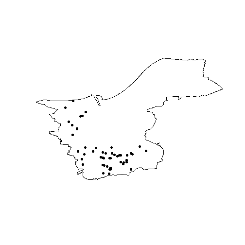

# Introduction

open311 is an international open-access standard for civic issue management
and public service communication.
The standard allows administrations to better manage citizen requests,
citizens to more easily participate in administrative work, and researchers
and data scientists to access data regarding public service communication.
As an open standard, open311 is not a centralized API, but a framework
implemented by various cities (e.g. San Francisco, CA, Chicago, IL, Cologne,
DE, Turku, FI, Zurich, CH) and services (e.g. SeeClickFix, FixMyStreet).

It is way past the golden age of open311 APIs and much of development in
civic issue tracking has shifted to less open-access and less standardized
alternatives. Many former prime examples have abandoned or severely limited
their open311 endpoints. Nonetheless, open311 still constitutes a valuable
source for open government data. Many cities and services still maintain an
open311 service.

`r311` allows the seamless management and selection of endpoints and
retrieval of service and request data. It supports (but does not depend on)
many popular R frameworks such as the tidyverse, `sf` and `xml2` for
response formatting. `r311` is designed to be slim, both in content
and dependencies. It imports only two import-less packages used for HTTP
response handling. The functionality is limited to two main features:

- Endpoint management
- Sending requests

This vignette will briefly cover these two features.


# Endpoints

Since open311 is an open and decentralized standard, there is not one but
many endpoints that one can access. An endpoint is commonly implemented by
a city administration, but can also be managed by a service provider such
as FixMyStreet. Each endpoint can define multiple jurisdiction IDs, although,
in practice, most endpoints only define a single jurisdiction.

It can thus be difficult to manage the multitude of endpoints and jurisdictions.
Efforts have been made to list open311 servers, but most of them are
incomplete or outdated. `r311` offers an updated and modifiable endpoint list
that defines a number of open311 implementations that are defined for use in
the package. The list can be read using `o311_endpoints`.


``` r
o311_endpoints()
#> # A tibble: 69 × 12
#>    name            root  docs  jurisdiction key   pagination limit json  dialect deprecated deprecated_reason deprecated_url
#>    <chr>           <chr> <chr> <chr>        <lgl> <lgl>      <int> <lgl> <chr>   <lgl>      <chr>             <chr>         
#>  1 Annaberg-Buchh… http… http… annberg-buc… FALSE TRUE          50 TRUE  Mark-a… TRUE       switched          https://buerg…
#>  2 Bloomington, IN http… <NA>  bloomington… FALSE TRUE        1000 TRUE  uReport FALSE      <NA>              <NA>          
#>  3 Bonn, DE        http… http… bonn.de      FALSE TRUE         100 TRUE  Mark-a… FALSE      <NA>              <NA>          
#>  4 Boston, MA      http… http… <NA>         FALSE TRUE          50 TRUE  Connec… FALSE      <NA>              <NA>          
#>  5 Brookline, MA   http… http… brooklinema… FALSE TRUE          50 TRUE  Connec… FALSE      <NA>              <NA>          
#>  6 Austin, TX      http… http… <NA>         FALSE TRUE          50 TRUE  Connec… FALSE      <NA>              <NA>          
#>  7 Chicago, IL     311a… 311a… cityofchica… FALSE TRUE          50 TRUE  Connec… FALSE      <NA>              <NA>          
#>  8 Newport News, … http… http… cityofnewpo… FALSE TRUE          50 TRUE  Connec… FALSE      <NA>              <NA>          
#>  9 San Diego, CA   http… http… sandiego.gov FALSE TRUE          50 TRUE  Connec… FALSE      <NA>              <NA>          
#> 10 Köln / Cologne… http… <NA>  stadt-koeln… FALSE TRUE          50 TRUE  Mark-a… FALSE      <NA>              <NA>          
#> # ℹ 59 more rows
```

The list does neither claim comprehensiveness nor up-to-dateness. It arguably
provides some of the most important and easily accessible endpoints as of
2025. However, `r311` also offers the ability to add
new endpoints to `o311_endpoints` using `o311_add_endpoint`. You need to
provide a name (for lookup) and a root URL (the URL used to send requests).
The following code adds the open311 test server of Mecklenburg-Vorpommern,
Germany.


``` r
o311_add_endpoint(
  name = "MV Test",
  root = "https://klarschiff-mv.sis-schwerin.de/backoffice/citysdk/",
  jurisdiction = "rostock.de"
)
```

Retrieving the endpoints list again confirms that you successfully added a
new row to the endpoints dataframe.


``` r
nrow(o311_endpoints())
#> [1] 70
```

You can now select the Rostock test API to the session using `o311_api`.
This function matches an API using endpoint name and jurisdiction ID and
attaches it to the active session. Query functions automatically detect the
attached API.


``` r
o311_api("MV Test")
```

After attaching an API, `o311_ok` confirms that the selected endpoint is able
to handle request queries.


``` r
o311_ok()
#> [1] TRUE
```

As the result is `TRUE`, you can safely start receiving real request data.


# Making requests

After selecting an API and attaching it to the session, all \code{o311_*}
functions can access it. You can now make requests.

## Services

To get an overview of the available services in a jurisdiction, you can
use `o311_services`, which returns a list of Rostock's administrative
services.


``` r
o311_services()
#> # A tibble: 183 × 8
#>    service_code service_name                       description metadata type     keywords group            group_id
#>    <chr>        <chr>                              <lgl>       <lgl>    <chr>    <chr>    <chr>               <int>
#>  1 127          Ampel behindertengerecht gestalten NA          FALSE    realtime idea     Barrierefreiheit       11
#>  2 128          Ampelschaltung ändern              NA          FALSE    realtime idea     Barrierefreiheit       11
#>  3 129          Bordstein absenken                 NA          FALSE    realtime idea     Barrierefreiheit       11
#>  4 130          Zugang rollstuhlgerecht gestalten  NA          FALSE    realtime idea     Barrierefreiheit       11
#>  5 131          Ampelschaltung ändern              NA          FALSE    realtime idea     Fahrradverkehr         12
#>  6 132          Beleuchtung verändern              NA          FALSE    realtime idea     Fahrradverkehr         12
#>  7 133          Beschilderung/Markierung ändern    NA          FALSE    realtime idea     Fahrradverkehr         12
#>  8 134          Beschilderung/Markierung einführen NA          FALSE    realtime idea     Fahrradverkehr         12
#>  9 135          Bordstein absenken                 NA          FALSE    realtime idea     Fahrradverkehr         12
#> 10 136          Fahrradständer aufstellen          NA          FALSE    realtime idea     Fahrradverkehr         12
#> # ℹ 173 more rows
```


## Requests

To get data about civic issues in the city area, run `o311_requests`.


``` r
o311_requests()
#> Simple feature collection with 52 features and 15 fields
#> Geometry type: POINT
#> Dimension:     XY
#> Bounding box:  xmin: 11.17392 ymin: 53.38346 xmax: 13.31174 ymax: 54.20873
#> Geodetic CRS:  WGS 84
#> # A tibble: 52 × 16
#>    service_request_id status_notes            status service_code service_name description agency_responsible service_notice
#>                 <int> <chr>                   <chr>         <int> <chr>        <chr>       <chr>              <lgl>         
#>  1                263 <NA>                    recei…           30 Sperrmüll    redaktione… Abfallwirtschaft … NA            
#>  2                217 <NA>                    recei…          103 Baum schadh… redaktione… Forstamt           NA            
#>  3                272 Reparatur beauftragt    in_pr…            4 bauliche Ge… Hier ist ü… LK-LUP-Verkehr     NA            
#>  4                150 Vielen Dank für Ihren … in_pr…            5 Beleuchtung… Straßenlat… Bauamt             NA            
#>  5                173 Vorgang wurde zur Bear… in_pr…            3 Ampel schad… Ampel scha… Regional-Administ… NA            
#>  6                154 Das Anliegen wird im B… in_pr…           13 Hundekot     Die Haltes… Beschwerdemanagem… NA            
#>  7                210 <NA>                    recei…          117 Wegereinigu… redaktione… Forstamt           NA            
#>  8                201 <NA>                    recei…          162 Schutzhütte… redaktione… Forstamt           NA            
#>  9                166 Verstanden.             in_pr…            3 Ampel schad… redaktione… Bauamt (Amt Rosto… NA            
#> 10                245 Vielen Dank für den Hi… in_pr…            8 Beschilderu… Zusatzzeic… Parchim - FB 3 Re… NA            
#> # ℹ 42 more rows
#> # ℹ 8 more variables: requested_datetime <chr>, updated_datetime <chr>, expected_datetime <lgl>, address <chr>,
#> #   adress_id <lgl>, media_url <chr>, zipcode <lgl>, geometry <POINT [°]>
```

Using the output of `o311_services`, you can further narrow down the output
of requests. Open311 defines a set of standard parameters which are implemented
by all endpoints. Using the `service_code` parameter with one of the previously
returned service codes, only complaints about broken traffic lights are returned.


``` r
o311_requests(service_code = "3")
#> Simple feature collection with 6 features and 15 fields
#> Geometry type: POINT
#> Dimension:     XY
#> Bounding box:  xmin: 11.84164 ymin: 53.41644 xmax: 12.31198 ymax: 54.20656
#> Geodetic CRS:  WGS 84
#> # A tibble: 6 × 16
#>   service_request_id status_notes             status service_code service_name description agency_responsible service_notice
#>                <int> <chr>                    <chr>         <int> <chr>        <chr>       <chr>              <lgl>         
#> 1                166 Verstanden.              in_pr…            3 Ampel schad… "redaktion… Bauamt (Amt Rosto… NA            
#> 2                158 <NA>                     revie…            3 Ampel schad… "Die Ampel… Straßenmeisterei … NA            
#> 3                251 <NA>                     recei…            3 Ampel schad… "redaktion… LK-LUP-Verkehr     NA            
#> 4                173 Vorgang wurde zur Bearb… in_pr…            3 Ampel schad… "Ampel sch… Regional-Administ… NA            
#> 5                250 Vielen Dank für die Mel… in_pr…            3 Ampel schad… "Ampel aus… LK-LUP-Verkehr     NA            
#> 6                273 <NA>                     recei…            3 Ampel schad… "Die Daten… Standardzuständig… NA            
#> # ℹ 8 more variables: requested_datetime <chr>, updated_datetime <chr>, expected_datetime <lgl>, address <chr>,
#> #   adress_id <lgl>, media_url <lgl>, zipcode <lgl>, geometry <POINT [°]>
```

Similarly, using a `service_request_id` from the output, you can retrieve a
single service request from the API.


``` r
o311_request("250")
#> Simple feature collection with 1 feature and 15 fields
#> Geometry type: POINT
#> Dimension:     XY
#> Bounding box:  xmin: 11.86831 ymin: 53.43376 xmax: 11.86831 ymax: 53.43376
#> Geodetic CRS:  WGS 84
#> # A tibble: 1 × 16
#>   service_request_id status_notes             status service_code service_name description agency_responsible service_notice
#>                <int> <chr>                    <chr>         <int> <chr>        <chr>       <chr>              <lgl>         
#> 1                250 Vielen Dank für die Mel… in_pr…            3 Ampel schad… Ampel ausg… LK-LUP-Verkehr     NA            
#> # ℹ 8 more variables: requested_datetime <chr>, updated_datetime <chr>, expected_datetime <lgl>, address <chr>,
#> #   adress_id <lgl>, media_url <lgl>, zipcode <lgl>, geometry <POINT [°]>
```


## Bulk queries

Many endpoints define a page limit meaning that responses are divided into
pages. A query without parameters returns the first page. Pagination can be
controlled with the `page` argument. To control pagination, the
`o311_request_all` function can come in handy. It automatically iterates
through pages and heuristically decides when to stop. The following example
retrieves data from the first two pages, resulting in a tibble with 200
service requests.


``` r
o311_api("Cologne")
o311_request_all(max_pages = 2)
#> Simple feature collection with 200 features and 11 fields
#> Geometry type: POINT
#> Dimension:     XY
#> Bounding box:  xmin: 6.820434 ymin: 50.85319 xmax: 7.104497 ymax: 51.05203
#> Geodetic CRS:  WGS 84
#> # A tibble: 200 × 12
#>    service_request_id title     description address_string service_name requested_datetime updated_datetime status media_url
#>    <chr>              <chr>     <chr>       <chr>          <chr>        <chr>              <chr>            <chr>  <chr>    
#>  1 1345-2025          #1345-20… "Die Abspe… 50674 Köln - … Straßenbaus… 2025-01-15T15:39:… 2025-02-15T09:2… closed "https:/…
#>  2 1348-2025          #1348-20… "Sehr geeh… 51103 Köln - … Defekte Obe… 2025-01-15T15:55:… 2025-01-16T14:0… closed "https:/…
#>  3 1346-2025          #1346-20… "Hier entl… 50935 Köln - … Defekte Obe… 2025-01-15T15:56:… 2025-01-16T14:0… closed ""       
#>  4 1347-2025          #1347-20… "Dürenerst… 50935 Köln - … Defekte Obe… 2025-01-15T15:58:… 2025-01-16T14:0… closed ""       
#>  5 1349-2025          #1349-20… "Vom Obere… 50969 Köln - … Kfz-Ampel d… 2025-01-15T16:24:… 2025-02-15T06:2… closed ""       
#>  6 1351-2025          #1351-20… "Stolperfa… 50999 Köln - … Defekte Obe… 2025-01-15T16:27:… 2025-01-16T14:0… closed "https:/…
#>  7 1350-2025          #1350-20… "Laterne h… 50823 Köln - … Leuchtmitte… 2025-01-15T16:28:… 2025-02-15T12:2… closed "https:/…
#>  8 1352-2025          #1352-20… "Wilder Mü… 51109 Köln - … Wilder Müll  2025-01-15T16:37:… 2025-02-15T12:2… closed "https:/…
#>  9 1353-2025          #1353-20… "Der Fußwe… 50677 Köln - … Defekte Obe… 2025-01-15T17:17:… 2025-01-16T14:1… closed "https:/…
#> 10 1354-2025          #1354-20… "Seit Mona… 50823 Köln - … Schrottfahr… 2025-01-15T17:40:… 2025-01-16T11:4… open   ""       
#> # ℹ 190 more rows
#> # ℹ 3 more variables: status_note <chr>, service_code <chr>, geometry <POINT [°]>
```


## Non-standard parameters

`r311` implicitly supports API extensions introducing custom paths and
parameters. One such API is Klarschiff Rostock which is based on CitySDK.
Klarschiff CitySDK defines a number of non-default paths and parameters which
extend the filtering abilities of open311 requests. Available parameters can
usually be found in the respective documentation (e.g. on GitHub for
[Klarschiff CitySDK](https://github.com/bfpi/klarschiff-citysdk)).
The following query returns the last 50 requests tagged with the "idea" keyword.


``` r
o311_api("Rostock, DE")
tickets <- o311_requests(keyword = "idea", max_requests = 50)
tickets
#> Simple feature collection with 50 features and 15 fields
#> Geometry type: POINT
#> Dimension:     XY
#> Bounding box:  xmin: 12.0452 ymin: 54.06011 xmax: 12.17308 ymax: 54.17656
#> Geodetic CRS:  WGS 84
#> # A tibble: 50 × 16
#>    service_request_id status_notes            status service_code service_name description agency_responsible service_notice
#>                 <int> <chr>                   <chr>         <int> <chr>        <chr>       <chr>              <lgl>         
#>  1              48005 <NA>                    recei…           93 Beschilderu… "redaktion… Tiefbauamt (Unter… NA            
#>  2              42258 <NA>                    revie…           99 Beschilderu… "Oft kommt… Tiefbauamt (Unter… NA            
#>  3              50762 <NA>                    recei…          113 Beschilderu… "redaktion… Tiefbauamt (Unter… NA            
#>  4              40539 <NA>                    revie…          112 Beschilderu… "Sehr geeh… Tiefbauamt (Unter… NA            
#>  5              45486 <NA>                    recei…          113 Beschilderu… "redaktion… Tiefbauamt (Unter… NA            
#>  6              42022 <NA>                    recei…          112 Beschilderu… "Nach dem … Tiefbauamt (Unter… NA            
#>  7              46210 <NA>                    recei…           93 Beschilderu… "redaktion… Tiefbauamt (Unter… NA            
#>  8              50520 <NA>                    recei…          113 Beschilderu… "redaktion… Tiefbauamt (Unter… NA            
#>  9              40653 Vielen Dank für Ihren … in_pr…           93 Beschilderu… "Wenn ich … Tiefbauamt (Unter… NA            
#> 10              42112 <NA>                    recei…           99 Beschilderu… "redaktion… Tiefbauamt (Unter… NA            
#> # ℹ 40 more rows
#> # ℹ 8 more variables: requested_datetime <chr>, updated_datetime <chr>, expected_datetime <lgl>, address <chr>,
#> #   adress_id <lgl>, media_url <chr>, zipcode <lgl>, geometry <POINT [°]>
```

Some custom parameters can also alter the shape of the output. In the following
example, we query just the count of total requests using the `just_count`
parameter. The result is a 1×1 tibble containing a count value.


``` r
o311_requests(just_count = TRUE)
#> # A tibble: 1 × 1
#>   value
#>   <int>
#> 1  3352
```

The CitySDK extensions also offers additional URL paths which can be queried
using the generic `o311_query` function.


``` r
poly <- o311_query("areas")
plot(poly$grenze)
plot(tickets$geometry, add = TRUE, pch = 16)
```




# Cleanup

Endpoint data is stored persistently between sessions so that you can create
your own database of open311 endpoints. This database is stored in the system's
user directory as returned by `tools::R_user_dir("r311")`. To reset the
database, run


``` r
o311_reset_endpoints()
```

This will default back to the endpoints defined by `r311` and remove all
endpoints manually added by `o311_add_endpoints`.

